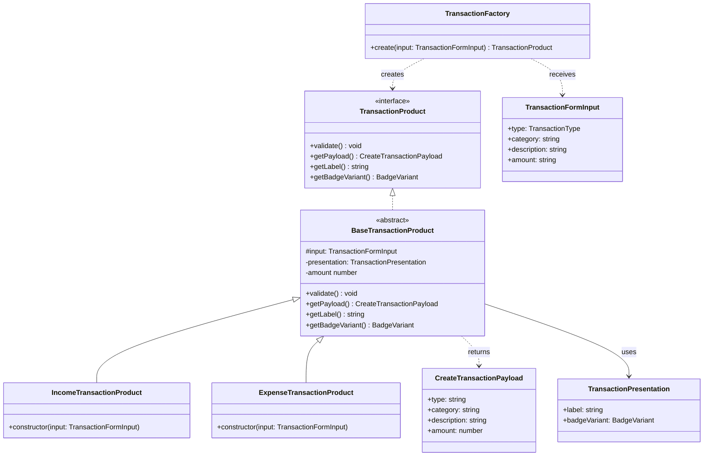
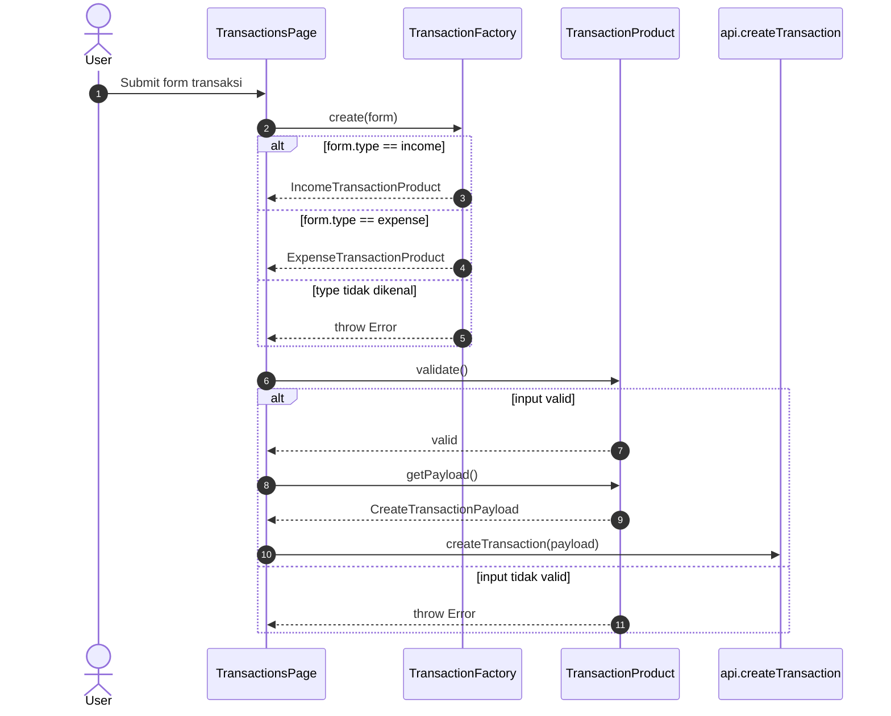
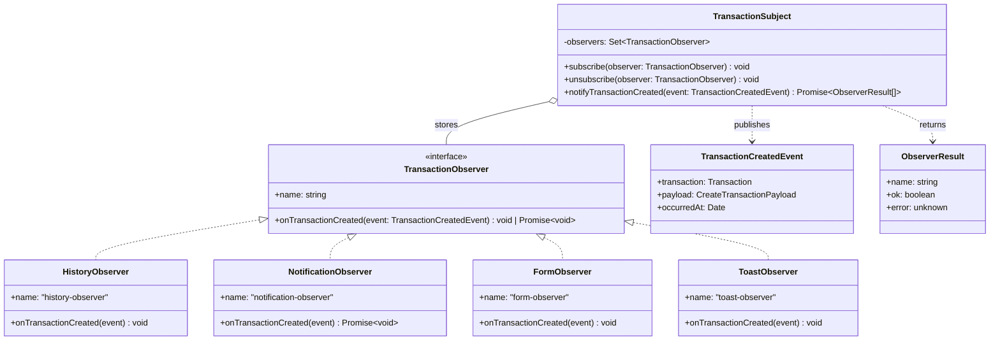
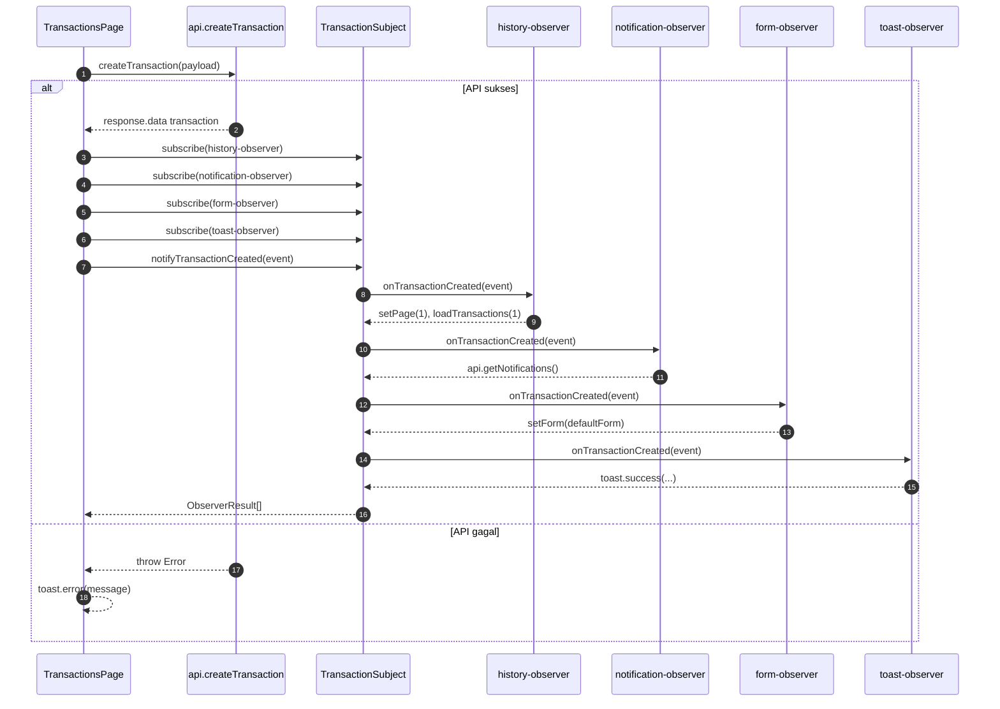
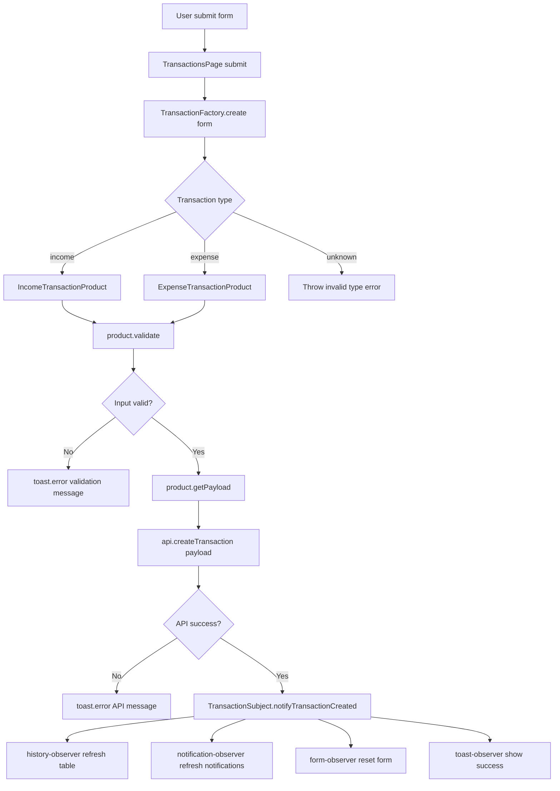

# UML Diagram: Transaction Factory dan Observer

Dokumen ini berisi UML diagram untuk dua pattern pada modul transaksi web:

- `transaction-factory.ts` sebagai Factory Pattern.
- `transaction-observer.ts` sebagai Observer Pattern.

Diagram menggunakan Mermaid, sehingga bisa dirender langsung oleh Markdown viewer yang mendukung Mermaid.

## 1. Class Diagram - Transaction Factory

Factory Pattern memusatkan pembuatan product transaksi. `TransactionsPage` tidak membuat payload secara manual, tetapi meminta `TransactionFactory` membuat `TransactionProduct` berdasarkan `TransactionFormInput.type`.

### Penjelasan

- `TransactionFactory` adalah pembuat product.
- `TransactionProduct` adalah kontrak yang harus dipenuhi product transaksi.
- `BaseTransactionProduct` berisi logic umum: validasi, trim field, konversi amount, dan pembuatan payload.
- `IncomeTransactionProduct` dan `ExpenseTransactionProduct` adalah product konkret.
- `TransactionPresentation` menyimpan metadata tampilan seperti label dan variant badge.

## 2. Sequence Diagram - Factory saat Submit Transaksi

Diagram ini menunjukkan alur saat user submit form transaksi sampai payload siap dikirim ke API.

### Penjelasan

- Page hanya memberi form input ke factory.
- Factory memilih product berdasarkan tipe transaksi.
- Product melakukan validasi.
- Product membuat payload API.
- API hanya dipanggil jika validasi berhasil.

## 3. Class Diagram - Transaction Observer

Observer Pattern memisahkan efek samping setelah transaksi berhasil dibuat. `TransactionSubject` menyimpan daftar observer dan mengirim event `TransactionCreatedEvent` ke setiap observer.

### Penjelasan

- `TransactionSubject` adalah subject/publisher.
- `TransactionObserver` adalah kontrak observer.
- `TransactionCreatedEvent` adalah data event yang dikirim setelah transaksi berhasil dibuat.
- `ObserverResult` menyimpan status sukses/gagal setiap observer.
- Observer konkret pada `TransactionsPage` dibuat sebagai object literal:
  - `history-observer`: refresh riwayat transaksi.
  - `notification-observer`: refresh notifikasi.
  - `form-observer`: reset form.
  - `toast-observer`: tampilkan toast sukses.

## 4. Sequence Diagram - Observer setelah API Sukses

Diagram ini menunjukkan alur setelah transaksi berhasil dibuat oleh API.

### Penjelasan

- Observer hanya dipanggil setelah API berhasil.
- Jika API gagal, event tidak dipublish.
- Setiap observer menjalankan satu tanggung jawab.
- `TransactionSubject` menangkap error per observer sehingga observer lain tetap bisa berjalan.

## 5. Combined Flow Diagram

Diagram ini menggabungkan Factory Pattern dan Observer Pattern dalam satu alur transaksi.

## 6. Ringkasan Peran Pattern

| Pattern | File | Dipakai Saat | Tanggung Jawab |
| --- | --- | --- | --- |
| Factory | `transaction-factory.ts` | Sebelum request API | Membuat product transaksi, validasi, membuat payload, metadata UI |
| Observer | `transaction-observer.ts` | Setelah request API sukses | Menjalankan efek samping UI setelah transaksi dibuat |

Factory menjawab:

> Product transaksi apa yang harus dibuat dari input form ini?

Observer menjawab:

> Setelah transaksi berhasil dibuat, bagian mana saja yang perlu diberi tahu?

Kombinasi keduanya membuat halaman Transactions lebih rapi karena logic pembuatan payload dan efek samping tidak menumpuk di satu fungsi submit.
